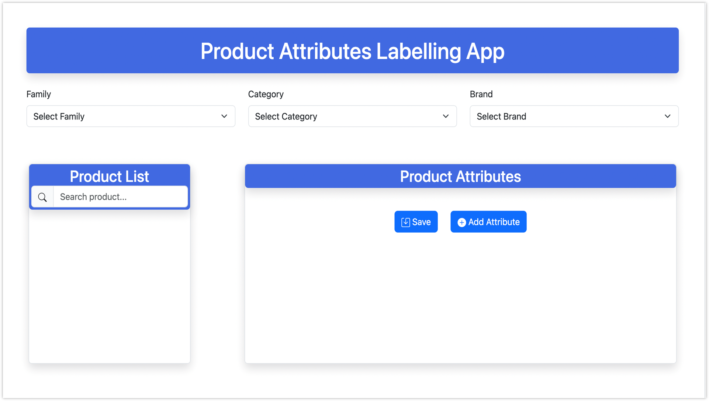

# 🍿 Product Attribute Labelling App

## 📖 Overview

The **Product Attribute Labelling App** is a Django-based web application designed to help users manage and label product attributes efficiently. It provides an intuitive interface to filter products by **Family**, **Category**, and **Brand**, search for specific products, and add or save product attributes with ease.

> ⚡ Ideal for e-commerce teams managing product data at scale.

## 🗼 Screenshot

<!-- Add a screenshot here -->



---

## ✨ Features

* 🔍 **Filter Products** by *Family*, *Category*, and *Brand* using dropdowns.
* 🧠 **Search Bar** to quickly locate products by name or identifier.
* 🗞 **View & Edit Product Attributes** in a dedicated section.
* 📂 **Save Changes** or ➕ **Add New Attributes** with user-friendly buttons.

---

## 📦 Prerequisites

Ensure the following are installed on your system:

* Python 3.x
* `pip` (Python package manager)

---

## ⚙️ Setup Instructions

1. **Clone the repository**

```bash
git clone https://github.com/kavinandan18/product-attribute.git
```

2. **Navigate to the project directory**

```bash
cd product-attribute
```

3. **Create a virtual environment (recommended)**

```bash
python -m venv venv
source venv/bin/activate  # On Windows: venv\Scripts\activate
```

4. **Install required dependencies**

```bash
pip install -r requirements.txt
```

5. **Apply Django migrations**

```bash
python manage.py migrate
```

6. **Run the development server**

```bash
python manage.py runserver
```

7. **Access the app in your browser**
   Visit: [http://localhost:8000](http://localhost:8000)

---

## 🚀 Usage

1. Open the app in your web browser.
2. Use dropdown menus to filter products by Family, Category, and Brand.
3. Search for products in the **Product List** section.
4. View or edit product attributes in the **Product Attributes** section.
5. Use **"Add Attribute"** to include new ones or **"Save"** to update changes.

---

## 🤝 Contributing

Contributions are welcome! Follow these steps to contribute:

```bash
# 1. Fork the repository
# 2. Create a new branch
git checkout -b feature/your-feature

# 3. Make your changes and commit
git commit -m "Add your feature"

# 4. Push to your branch
git push origin feature/your-feature

# 5. Create a pull request on GitHub
```

---

## 📄 License

This project is licensed under the **MIT License**. See the [LICENSE](LICENSE) file for details.
